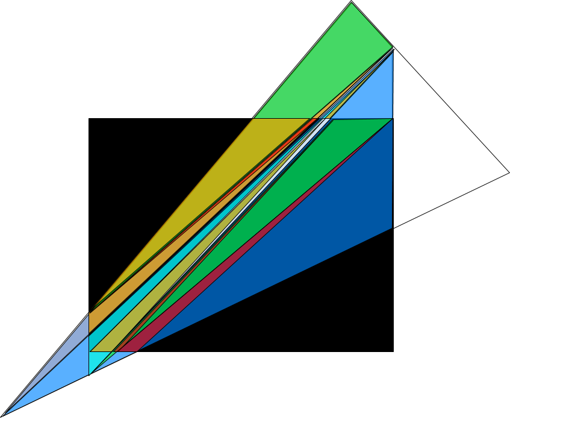

# My 3D Engine

A 3D engine made with ggez in rust.

WARNING: This program may potentially trigger seizures for people with photosensitive epilepsy. Viewer discretion is advised.

# V1

Basic Working algorithm for rendering 3d models

# V2

Implements Multithreading
Better projection Algorithm
Crop triangles to fit screen
Better comments.

# Todo
 ## Bug Fix
 - Fix diagonal turning mirror error
 - Fix the big triangles glitch
 - Clipping stack overflow error

 - <!> Clean lighting <!>
 ## UI
  + Export Stl and Obj
  + Object manipulation
   - Rotation
   - Movement
   - Scale
  + Vertex manipulation
  + divide sides
  + background manipulation
  + Lock look
  + vertex mode
  + transparent mode